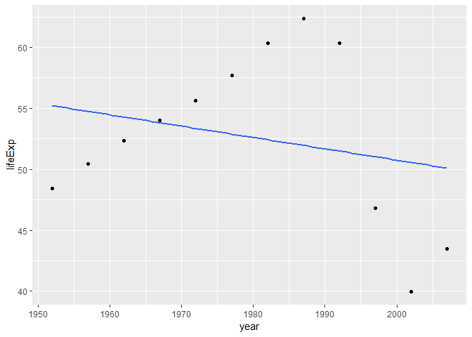
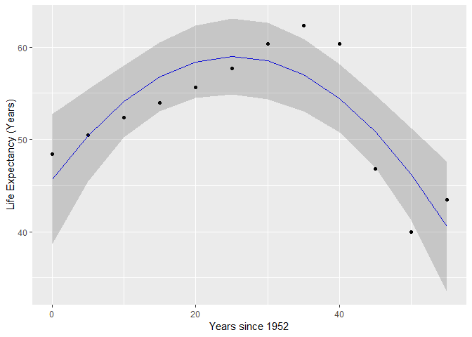

STAT547M Assignment 6
================
Alex
November 7, 2018

-   [Writing a function to work with the Gapminder dataset](#writing-a-function-to-work-with-the-gapminder-dataset)
    -   [Extension of the linear regression function from [this STAT545 page](http://stat545.com/block012_function-regress-lifeexp-on-year.html)](#extension-of-the-linear-regression-function-from-this-stat545-page)
        -   [Adding a quadratic term](#adding-a-quadratic-term)
        -   [Output a scatter plot with regression lines](#output-a-scatter-plot-with-regression-lines)
-   [Working with nested datasets](#working-with-nested-datasets)
    -   [Nesting the Gapminder data frame](#nesting-the-gapminder-data-frame)
    -   [Applying our functions to the nested dataset](#applying-our-functions-to-the-nested-dataset)
    -   [Unnesting the regression results](#unnesting-the-regression-results)
    -   [Comparing goodness of fit between linear and quadratic models](#comparing-goodness-of-fit-between-linear-and-quadratic-models)
    -   [Visualizing the regression models](#visualizing-the-regression-models)

``` r
knitr::opts_chunk$set(echo = TRUE)

library(tidyverse)
library(dplyr)
library(ggplot2)
library(gapminder)
library(kableExtra)
library(broom)
```

Writing a function to work with the Gapminder dataset
=====================================================

Extension of the linear regression function from [this STAT545 page](http://stat545.com/block012_function-regress-lifeexp-on-year.html)
---------------------------------------------------------------------------------------------------------------------------------------

*Additional function writing has been done in the next section on nested datasets as well.*

The original linear regression function from the above webpage takes a subset of the gapminder data set and runs a linear regression model with life expectancy as the outcome and year as the predictor, then outputs the coefficients of the model:

``` r
le_lin_fit <- function(dat, offset = 1952) {
  the_fit <- lm(lifeExp ~ I(year - offset), dat)
  setNames(coef(the_fit), c("intercept", "slope"))
}
```

We will add some extra functionality to this.

### Adding a quadratic term

A linear regression is good for estimating the relationship between variables that are proportional to each other (i.e. *y* = *b*<sub>0</sub> + *b*<sub>1</sub>*x*<sub>1</sub> where *b*<sub>0</sub> is your intercept and *b*<sub>1</sub> is the estimated slope). However, this is a very simple model, and many real-world datasets will have more complex relationships. Consider the example of Zimbabwe's life expectancy in the gapminder dataset:

``` r
gapminder %>% 
  filter(country == "Zimbabwe") %>%
  ggplot(aes(year, lifeExp)) +
  geom_point() +
  geom_smooth(method="lm", se=FALSE) # plot a linear regression line given by aes() arguments
```



``` r
gapminder %>% filter(country == "Zimbabwe") %>% le_lin_fit
```

    ##   intercept       slope 
    ## 55.22124359 -0.09302098

Clearly the relationship is not linear. Let's edit the le\_lin\_fit() function to include a quadratic term in the regression:

``` r
quad_reg <- function(dat, offset = 1952){
  model <- lm(lifeExp ~ I(year - offset) + I((year - offset)^2), dat)
  setNames(coef(model), c("intercept", "slope", "sq term")) 
}

gapminder %>% filter(country == "Zimbabwe") %>% quad_reg()
```

    ##   intercept       slope     sq term 
    ## 45.69740659  1.04983946 -0.02077928

### Output a scatter plot with regression lines

A regression model with just the coefficients and the p-value tells us little about the fit of the model and the distribution of the data. A scatter plot with a linear regression line will give valuable quantitative data.

However, we cannot continue using `geom_smooth()` to add our regression lines as we have created our own more complicated model with a quadratic term. Instead we will use the `predict()` function to generate values from a given regression model and feed those into `geom_line()`.

We can streamline this process by writing a function to do this. First let's edit our quad\_reg() function to just output the model so that we can call the function in our plotting function:

``` r
quad_reg <- function(dat, offset = 1952){
  lm(lifeExp ~ I(year - offset) + I((year - offset)^2), dat) # subtract offset from year allows for better interpretation of the intercept
}

gapminder %>% filter(country == "Zimbabwe") %>% quad_reg(.)
```

    ## 
    ## Call:
    ## lm(formula = lifeExp ~ I(year - offset) + I((year - offset)^2), 
    ##     data = dat)
    ## 
    ## Coefficients:
    ##          (Intercept)      I(year - offset)  I((year - offset)^2)  
    ##             45.69741               1.04984              -0.02078

Now let's create our function that will plot the scatter plot of the data as well as compare the regression lines from our linear regression and our quadratic regression:

``` r
plot_reg <- function(dat, quad_mod, offset = 1952){
  dat <- cbind(dat, predict(quad_mod, interval = "confidence")) #add predicted values as a new column to the given data frame
  
  ggplot(dat, aes(I(year - offset), lifeExp)) +
    geom_point() +
    geom_smooth(method="lm", colour = "Blue") + # linear regression line
    geom_line(aes(I(year - offset), fit),  colour = "Red", size=0.5) + # plot regression line by linking together a scatter plot of the predicted values from predict()
    geom_ribbon(aes(ymin = lwr, ymax = upr), alpha = 0.2) +# confidence interval
    labs(x = "Years since 1952", y = "Life Expectancy (Years)") +
    scale_colour_manual("",
                        breaks = c("Linear Fit", "Quadratic Fit"),
                        values = c("Blue", "Red"))
}

gapminder %>% filter(country == "Zimbabwe") %>% plot_reg(., quad_reg(.))
```



The quadratic regression (red) clearly fits the data better than the linear model (blue) from before!

Working with nested datasets
============================

Nesting the Gapminder data frame
--------------------------------

*Creation of the nested data frame follows the lesson by Jenny Bryan found [here](http://stat545.com/block024_group-nest-split-map.html#split-apply-combine)*

We will nest the gapminder dataframe by country and continent:

``` r
nested_ds <- gapminder %>%
  group_by(continent, country) %>%
  nest()

head(nested_ds)
```

    ## # A tibble: 6 x 3
    ##   continent country     data             
    ##   <fct>     <fct>       <list>           
    ## 1 Asia      Afghanistan <tibble [12 x 4]>
    ## 2 Europe    Albania     <tibble [12 x 4]>
    ## 3 Africa    Algeria     <tibble [12 x 4]>
    ## 4 Africa    Angola      <tibble [12 x 4]>
    ## 5 Americas  Argentina   <tibble [12 x 4]>
    ## 6 Oceania   Australia   <tibble [12 x 4]>

Using nest() after group\_by() collapses all the data pertaining to each distinct country in each continent into one row; i.e. all the data is now held in a list-column in column 3 for each country.

We can view how the data stored in the list column by subsetting the first element:

``` r
nested_ds[[1, "data"]]
```

    ## # A tibble: 12 x 4
    ##     year lifeExp      pop gdpPercap
    ##    <int>   <dbl>    <int>     <dbl>
    ##  1  1952    28.8  8425333      779.
    ##  2  1957    30.3  9240934      821.
    ##  3  1962    32.0 10267083      853.
    ##  4  1967    34.0 11537966      836.
    ##  5  1972    36.1 13079460      740.
    ##  6  1977    38.4 14880372      786.
    ##  7  1982    39.9 12881816      978.
    ##  8  1987    40.8 13867957      852.
    ##  9  1992    41.7 16317921      649.
    ## 10  1997    41.8 22227415      635.
    ## 11  2002    42.1 25268405      727.
    ## 12  2007    43.8 31889923      975.

In this list-column state, we can use map() from purrr inside mutate() in order to apply a function over each country, and store the results inside another list-column in column 4.

Applying our functions to the nested dataset
--------------------------------------------

Let's apply the linear regression from [this STAT545 lesson](http://stat545.com/block012_function-regress-lifeexp-on-year.html) and the quadratic regression function we created above to every country in the gapminder dataset. We will modify the linear regression to match the quadratic regression function we created above to output the entire fitted model (and not just the intercept and slope):

``` r
lin_reg <- function(dat, offset = 1952) {
  lm(lifeExp ~ I(year - offset), dat)
}

nested_ds <- nested_ds %>%
  mutate(lin_fit = map(data, lin_reg)) %>%
  mutate(quad_fit = map(data, quad_reg)) 

nested_ds[[1, "lin_fit"]]
```

    ## 
    ## Call:
    ## lm(formula = lifeExp ~ I(year - offset), data = dat)
    ## 
    ## Coefficients:
    ##      (Intercept)  I(year - offset)  
    ##          29.9073            0.2753

``` r
nested_ds[[1, "quad_fit"]]
```

    ## 
    ## Call:
    ## lm(formula = lifeExp ~ I(year - offset) + I((year - offset)^2), 
    ##     data = dat)
    ## 
    ## Coefficients:
    ##          (Intercept)      I(year - offset)  I((year - offset)^2)  
    ##            28.178687              0.482762             -0.003772

Now that we have fitted models for every country stored in columns 3 and 4, we can use tidy() from the broom package (from STAT545 Lecture 14) to summarize each model with the estimate, standard error, t-statistic, and p-value for each term in the model:

``` r
nested_ds <- nested_ds %>%
  mutate(tidy_lin = map(lin_fit, tidy)) %>%
  mutate(tidy_quad = map(quad_fit, tidy))
```

Unnesting the regression results
--------------------------------

We can now create a data frame containing just the results of our regressions by using the select() and unnest() functions. After unnesting, we can pick out just the coefficient estimates for each term in the model by using the spread() function:

``` r
gap_lin_coefs <- nested_ds %>%
  select(continent, country, tidy_lin) %>%
  unnest(tidy_lin) %>%
  select(continent, country, term, estimate) %>%
  mutate(term = recode(term, `(Intercept)` = "intercept", `I(year - offset)` = "slope")) %>%
  spread(key = term, value = estimate)

gap_quad_coefs <- nested_ds %>%
  select(continent, country, tidy_quad) %>%
  unnest(tidy_quad) %>%
  select(continent, country, term, estimate) %>%
  mutate(term = recode(term, `(Intercept)` = "intercept",
                       `I(year - offset)` = "slope",
                       `I((year - offset)^2)` = "quadratic")) %>% # rename estimate columns
  spread(key = term, value = estimate) %>%
  select(continent, country, intercept, slope, quadratic) # reorder columns to make more sense (estimates are in order of degree)

head(gap_lin_coefs)
```

    ## # A tibble: 6 x 4
    ##   continent country      intercept  slope
    ##   <fct>     <fct>            <dbl>  <dbl>
    ## 1 Africa    Algeria           43.4 0.569 
    ## 2 Africa    Angola            32.1 0.209 
    ## 3 Africa    Benin             39.6 0.334 
    ## 4 Africa    Botswana          52.9 0.0607
    ## 5 Africa    Burkina Faso      34.7 0.364 
    ## 6 Africa    Burundi           40.6 0.154

``` r
head(gap_quad_coefs)
```

    ## # A tibble: 6 x 5
    ##   continent country      intercept slope quadratic
    ##   <fct>     <fct>            <dbl> <dbl>     <dbl>
    ## 1 Africa    Algeria           41.9 0.741  -0.00313
    ## 2 Africa    Angola            30.1 0.450  -0.00438
    ## 3 Africa    Benin             37.9 0.540  -0.00375
    ## 4 Africa    Botswana          44.9 1.02   -0.0175 
    ## 5 Africa    Burkina Faso      31.5 0.740  -0.00684
    ## 6 Africa    Burundi           39.3 0.312  -0.00286

Now we have two very organized tables presenting the results of linear and quadratic regressions for every country in the gapminder dataset!

Comparing goodness of fit between linear and quadratic models
-------------------------------------------------------------

We can also compare the goodness of fit between the linear and quadratic regressions by applying glance() from the broom package to our previous nested dataset:

``` r
get_adj_rsq <- function(model){ # create a useful function to output only the adj rsq value from glance() to avoid cluttering data frame with unncessary variables
  glance(model)$adj.r.squared
}

gap_reg_rsq <- nested_ds %>%
  mutate(adj_r2_lin = as.numeric(map(lin_fit, get_adj_rsq))) %>% # wrap as.numeric() around map() in order to coerce the output to show up when we call head() (otherwise it will just show "dbl [1]")
  mutate(adj_r2_quad = as.numeric(map(quad_fit, get_adj_rsq))) %>%
  select(continent, country, adj_r2_lin, adj_r2_quad)

gap_reg_rsq
```

    ## # A tibble: 142 x 4
    ##    continent country     adj_r2_lin adj_r2_quad
    ##    <fct>     <fct>            <dbl>       <dbl>
    ##  1 Asia      Afghanistan      0.942       0.987
    ##  2 Europe    Albania          0.902       0.953
    ##  3 Africa    Algeria          0.984       0.990
    ##  4 Africa    Angola           0.877       0.974
    ##  5 Americas  Argentina        0.995       0.995
    ##  6 Oceania   Australia        0.978       0.991
    ##  7 Europe    Austria          0.991       0.993
    ##  8 Asia      Bahrain          0.963       0.997
    ##  9 Asia      Bangladesh       0.988       0.997
    ## 10 Europe    Belgium          0.994       0.995
    ## # ... with 132 more rows

Now we can filter this tibble to show us which countries were modelled better by the quadratic model by filtering:

``` r
gap_rsq_quad_better <- gap_reg_rsq %>%
  filter(adj_r2_quad > adj_r2_lin)


gap_rsq_quad_better
```

    ## # A tibble: 126 x 4
    ##    continent country     adj_r2_lin adj_r2_quad
    ##    <fct>     <fct>            <dbl>       <dbl>
    ##  1 Asia      Afghanistan      0.942       0.987
    ##  2 Europe    Albania          0.902       0.953
    ##  3 Africa    Algeria          0.984       0.990
    ##  4 Africa    Angola           0.877       0.974
    ##  5 Oceania   Australia        0.978       0.991
    ##  6 Europe    Austria          0.991       0.993
    ##  7 Asia      Bahrain          0.963       0.997
    ##  8 Asia      Bangladesh       0.988       0.997
    ##  9 Europe    Belgium          0.994       0.995
    ## 10 Africa    Benin            0.963       0.994
    ## # ... with 116 more rows

It seems that the majority of countries were plotted better by the quadratic model (126 out of 142 countries). Perhaps we narrow it down by seeing which countries were modelled poorly by a linear regression. We will choose an adj.r.sq of less than 0.5 to be a poor fit:

``` r
gap_rsq_poorfit <- gap_reg_rsq %>%
  filter(adj_r2_lin < 0.5)

gap_rsq_poorfit
```

    ## # A tibble: 15 x 4
    ##    continent country                  adj_r2_lin adj_r2_quad
    ##    <fct>     <fct>                         <dbl>       <dbl>
    ##  1 Africa    Botswana                   -0.0626        0.626
    ##  2 Africa    Central African Republic    0.443         0.865
    ##  3 Africa    Congo, Dem. Rep.            0.283         0.669
    ##  4 Africa    Congo, Rep.                 0.472         0.903
    ##  5 Africa    Cote d'Ivoire               0.212         0.842
    ##  6 Africa    Kenya                       0.387         0.873
    ##  7 Africa    Lesotho                    -0.00666       0.638
    ##  8 Africa    Liberia                     0.463         0.527
    ##  9 Africa    Namibia                     0.381         0.878
    ## 10 Africa    Rwanda                     -0.0811       -0.201
    ## 11 Africa    South Africa                0.244         0.771
    ## 12 Africa    Swaziland                  -0.0250        0.671
    ## 13 Africa    Uganda                      0.276         0.561
    ## 14 Africa    Zambia                     -0.0342        0.668
    ## 15 Africa    Zimbabwe                   -0.0381        0.647

We see that 15 countries were fitted poorly by our definitions, and interestingly they are all countries in Africa. This could be due to factors external to typical life expectancy growth such as warfare that may strike and lower life expectancies during isolated periods of time. Unsurprisingly, most of these countries were better fitted by a quadratic model as the quadratic term allows for the relationship to be non-monotonic. (*Exception here seems to be Rwanda, but as we know the Rwandan Genocide is a factor that may greatly outweigh any gradual changes that would be easily modelled using a second-order linear regression.*)

We can also visualize the goodness of fit visually using the plot\_reg() function we created in part 1 of this assignment.

Visualizing the regression models
---------------------------------

Initially I had wanted to use map() to apply my plot\_reg() function from the first part of the assignment to be able to visualize the linear and quadratic regressions for every country, but I encountered a lot of problems that I could not fix in time for assignment submission.....so this will be a WIP for the future!
