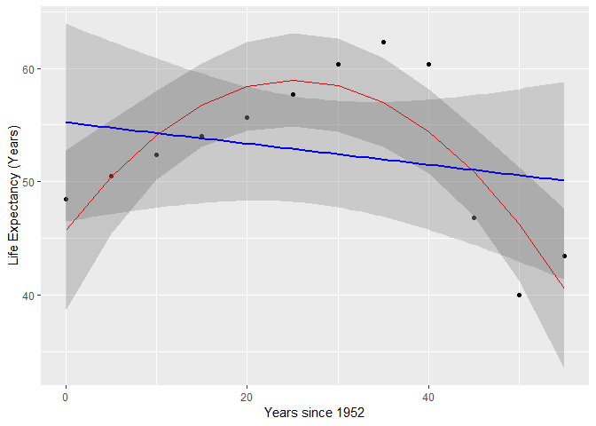

STAT547M Assignment 6
================
Alex
November 7, 2018

-   [Writing a function to work with the Gapminder dataset](#writing-a-function-to-work-with-the-gapminder-dataset)
    -   [Extension of the linear regression function from [this STAT545 page](http://stat545.com/block012_function-regress-lifeexp-on-year.html)](#extension-of-the-linear-regression-function-from-this-stat545-page)
        -   [Adding a quadratic term](#adding-a-quadratic-term)
        -   [Output a scatter plot with a linear regression line](#output-a-scatter-plot-with-a-linear-regression-line)
-   [Working with nested datasets](#working-with-nested-datasets)

``` r
knitr::opts_chunk$set(echo = TRUE)

library(tidyverse)
library(dplyr)
library(ggplot2)
library(gapminder)
library(kableExtra)
library(broom)
```

Writing a function to work with the Gapminder dataset
=====================================================

Extension of the linear regression function from [this STAT545 page](http://stat545.com/block012_function-regress-lifeexp-on-year.html)
---------------------------------------------------------------------------------------------------------------------------------------

The original linear regression function from the above webpage takes a subset of the gapminder data set and runs a linear regression model with life expectancy as the outcome and year as the predictor, then outputs the coefficients of the model:

``` r
le_lin_fit <- function(dat, offset = 1952) {
  the_fit <- lm(lifeExp ~ I(year - offset), dat)
  setNames(coef(the_fit), c("intercept", "slope"))
}
```

We will add some extra functionality to this.

### Adding a quadratic term

A linear regression is good for estimating the relationship between variables that are proportional to each other (i.e. *y* = *b*<sub>0</sub> + *b*<sub>1</sub>*x*<sub>1</sub> where *b*<sub>0</sub> is your intercept and *b*<sub>1</sub> is the estimated slope). However, this is a very simple model, and many real-world datasets will have more complex relationships. Consider the example of Zimbabwe's life expectancy in the gapminder dataset:

``` r
gapminder %>% 
  filter(country == "Zimbabwe") %>%
  ggplot(aes(year, lifeExp)) +
  geom_point() +
  geom_smooth(method="lm", se=FALSE) # plot a linear regression line given by aes() arguments
```


``` r
gapminder %>% filter(country == "Zimbabwe") %>% le_lin_fit
```

    ##   intercept       slope 
    ## 55.22124359 -0.09302098

Clearly the relationship is not linear. Let's edit the le\_lin\_fit() function to include a quadratic term in the regression:

``` r
quad_reg <- function(dat, offset = 1952){
  model <- lm(lifeExp ~ I(year - offset) + I((year - offset)^2), dat)
  setNames(coef(model), c("intercept", "slope", "sq term")) 
}

gapminder %>% filter(country == "Zimbabwe") %>% quad_reg()
```

    ##   intercept       slope     sq term 
    ## 45.69740659  1.04983946 -0.02077928

### Output a scatter plot with a linear regression line

A regression model with just the coefficients and the p-value tells us little about the fit of the model and the distribution of the data. A scatter plot with a linear regression line will give valuable quantitative data.

However, we cannot continue using `geom_smooth()` to add our regression lines as we have created our own more complicated model with a quadratic term. Instead we will use the `predict()` function to generate values from a given regression model and feed those into `geom_line()`.

We can streamline this process by writing a function to do this. First let's edit our quad\_reg() function to just output the model so that we can call the function in our plotting function:

``` r
quad_reg <- function(dat, offset = 1952){
  lm(lifeExp ~ I(year - offset) + I((year - offset)^2), dat) # subtract offset from year allows for better interpretation of the intercept
}
```

``` r
plot_reg <- function(dat, offset = 1952){
  model <- quad_reg(dat) # model calculated by our quadratic regression function we wrote earlier
  dat <- cbind(dat, predict(model, interval = "confidence")) #add predicted values as a new column to the given data frame
  
  ggplot(dat, aes(I(year - offset), lifeExp)) +
    geom_point() +
    geom_line(aes(I(year - offset), fit), colour = "Blue") + # plot regression line by linking together a scatter plot of the predicted values from predict()
    geom_ribbon(aes(ymin = lwr, ymax = upr), alpha = 0.2) + # confidence interval
    labs(x = "Years since 1952", y = "Life Expectancy (Years)")
}

gapminder %>% filter(country == "Zimbabwe") %>% plot_reg()
```



This regression clearly fits the data better than the linear model from before!

Working with nested datasets
============================
